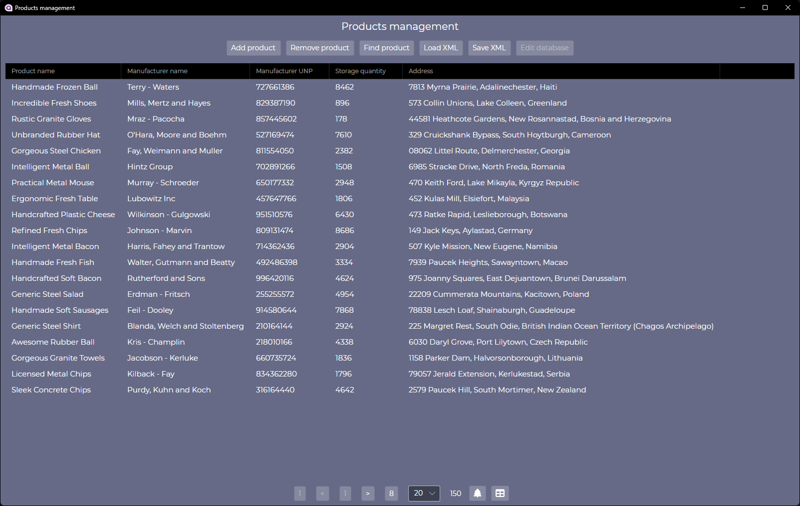
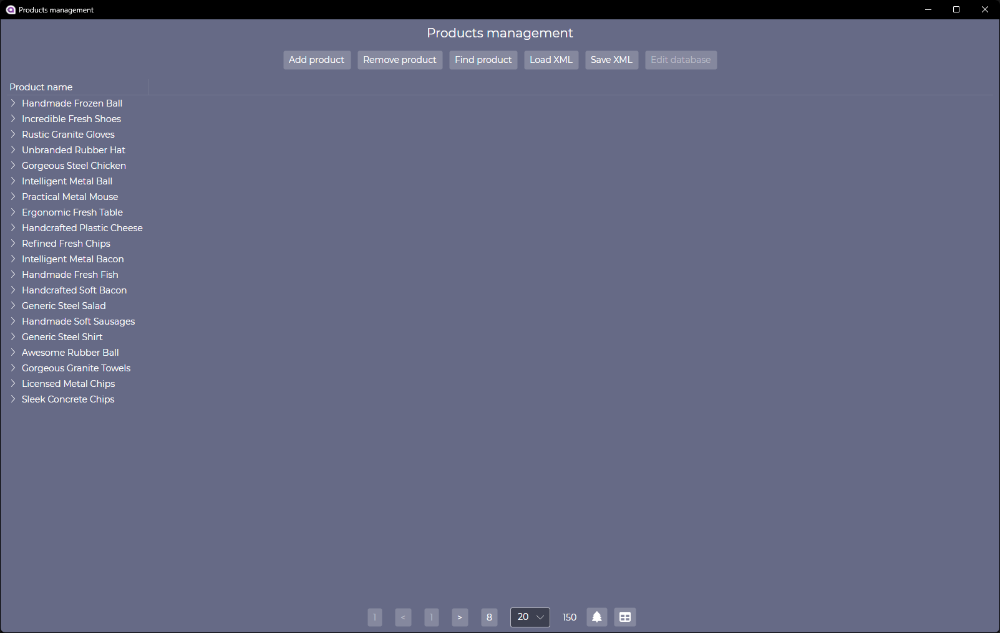
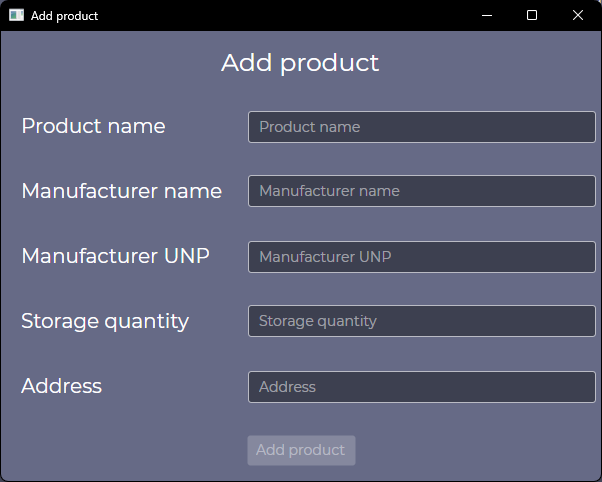
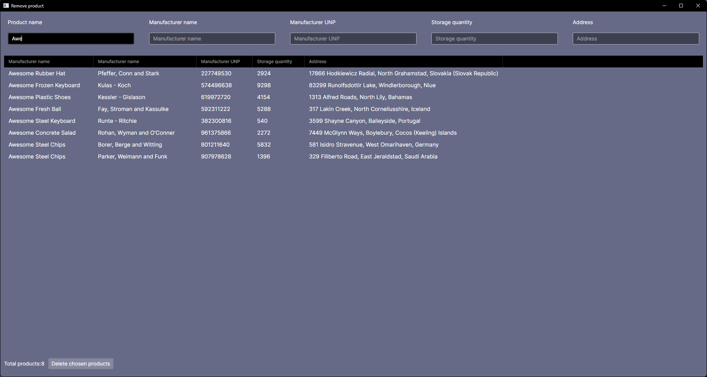

# ProductsManagement

Вариант 6

# Model

## Класс Product

Используется для представления товара в системе.

```c#
public string Name {get; set;}

public string ManufacturerName {get; set;}

public string ManufacturerUnp {get; set;}

public int StorageQuantity {get; set;}

public string Address {get; set;}
```

## Класс ProductsContext

Контекст для подключения базы данных (используется Microsoft SQL Server). В базе данных создаётся таблица Products для представления экземпляров класса Product с помощью миграции Entity Framework.

```c#
public DbSet<Product> Products { get; set; }
```

## Класс ProductsTable

Используется в качестве источника данных для таблицы товаров. Данные могут быть загружены из базы данных или из XML-файла, выбранного пользователем. Изменения, сделанные во время редактирования базы данных, автоматически сохраняются. Для сохранения изменений в XML-файле пользователь начинает соответствующий диалог и выбирает путь для сохранения файла с внесёнными изменениями.

Метод, который загружает данные из базы данных. 
```c#
private void LoadProductsFromDatabase()
```

Метод, который загружает данные из XML-файла.
```c#
private void LoadProductsFromXml()
```

Метод, который вносит изменения в базу данных.
```c#
private void UpdateDatabaseContext(object? sender, NotifyCollectionChangedEventArgs e)
```

Метод для сохранения XML-файла.
```c#
public async Task SaveXmlFile(IStorageFile file)
```

# View

## Главное окно (MainWindow)


Представление в форме таблицы


Представление в форме дерева

## Окно добавления товара (AddProductWindow)


## Окно удаления товара (окно поиска аналогично с меньшим функционалом) (FindProductWindow)


# ViewModel

MainWindow соответствует MainWindowViewModel

FindProductWindow соответствует FindProductViewModel

AddProductWindow соответствует AddProductViewModel

Для реализации MVVM используется Microsoft MVVM Community Toolkit. Для Data Binding свойств используется ObservableProperty, для вызова методов ViewModel из View используется RelayCommand.
